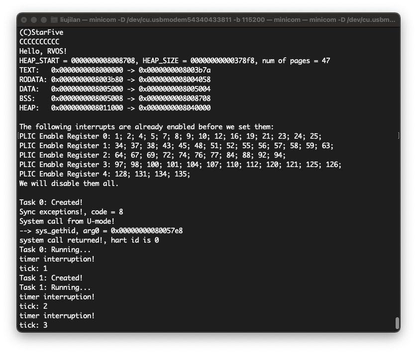

# RVOS_On_VisionFive2
RVOS在VisionFive2开发板上的移植。

[RVOS项目Github地址](https://github.com/plctlab/riscv-operating-system-mooc)

# 成果展示



```shell
(C)StarFive                                                                         
CCCCCCCCC                                                                           
Hello, RVOS!                                                                        
                                                                                    
HEAP_START = 0000000008007708, HEAP_SIZE = 00000000000388f8, num of pages = 48      
TEXT:   0x0000000008000000 -> 0x0000000008003aea                                    
RODATA: 0x0000000008003af0 -> 0x0000000008003fb8                                    
DATA:   0x0000000008004000 -> 0x0000000008004004                                    
BSS:    0x0000000008004008 -> 0x0000000008007708                                    
HEAP:   0x0000000008010000 -> 0x0000000008040000                                    
                                                                                    
The following interrupts are already enabled before we set them:                    
PLIC Enable Register 0: 1; 2; 4; 5; 8; 12; 16; 19; 21; 22; 23; 24;                  
PLIC Enable Register 1: 37; 38; 43; 51; 52; 55; 56; 57; 58; 59; 63;                 
PLIC Enable Register 2: 64; 67; 69; 72; 76; 77; 84; 92; 94;                         
PLIC Enable Register 3: 97; 98; 100; 101; 104; 107; 110; 117; 121; 126;             
PLIC Enable Register 4: 128; 131; 134; 135;                                         
We will disable them all. And then, only enable UART0.                              
                                                                                    
Task 0: Created!                                                                    
Sync exceptions!, code = 8                                                          
System call from U-mode!                                                            
--> sys_gethid, arg0 = 0x00000000080047e8                                           
system call returned!, hart id is 0                                                 
Task 0: Running...                                                                  
timer interruption!                                                                 
tick: 1                                                                             
Task 1: Created!                                                                    
Task 1: Running...                                                                  
timer interruption!
tick: 2                                                                             
timer interruption!
tick: 3
timer interruption!
tick: 4
timer interruption!
...
```


# 板子参数

CPU: JH7110 

> 使用IP: SiFive U74-MC (4+1核) + SiFive E24(会被当作外设被U74-MC额外启动)

UART: 8250芯片兼容

其他参数略


# 移植思路

对于一块板子, 尤其是这块板子比较新的时候。资料会散布在各个位置, 需要扫读能找到的所有资料, 大致了解你现在能知道什么, 并对每个信息的位置有个模糊的记忆。这对后期具体移植工作是有帮助的。


## CPU相关移植

RV32至RV64, 这个过程推荐在QEMU上完成。

主要是`lw`、`sw`换为`ld`、`sd`, 一些有关地址的`uint32_t`改为`uint64_t`。与寄存器相关的数据结构与偏移也需要相应调整。还有`printf`从32位移植到64位( `printf`改动全部由GPT4.0完成 )。移植过程见GitHub Commit历史。

PS: 我对PLIC Enable部分的一个宏做了补充修改。我觉得这属于老师的小失误, 因为原RVOS中, UART的PLIC中断ID是小于32的。

PS: 由于QEMU所模拟的芯片为SiFive旗下的FU540, 所以CLINT和PLIC部分几乎没有什么大的改动。


## 有关mtime频率

关于mtime, 在CPU手册的**6.11.1 Timer Register**节中提到:

> mtime is a 64-bit read-write register that contains the number of cycles counted from the rtc_toggle signal described in the U74-MC Core Complex User Guide. On reset, mtime is cleared to zero.

如果查看JH7110手册时钟图能看出24M的时钟被/6后引入了芯片的rtc_toggle中。

另外, 这个值会在设备树中以以下方式被引入:

```
cpus {
		timebase-frequency = <4000000>;
	};
```


## 启动流程

1. 对启动流程的研究是向具体开发板移植的第一步。参考了[昉·惊鸿7110启动手册](https://doc.rvspace.org/VisionFive2/Developing_and_Porting_Guide/JH7110_Boot_UG/index.html)。

    简言之的启动流程是:**BootROM** > **SPL** > **U-Boot** (OpenSBI + Uboot) > **Linux**

    

2. 确定我们的系统将取代启动流程中的哪一个步骤

   1. 由于RISC-V的体系结构设计, 我们要清楚自己要移植的系统是运行在什么权级的。这将是确定取代启动流程中哪个步骤的重要依据。

      在我们这次移植中: **RVOS的内核态就是运行在M态的**。

      

   2. 讨论每个替代部分的可行性

      | 可能替代的部分 | 可行性                                                       | 代价                                                         |
      | :------------- | :----------------------------------------------------------- | :----------------------------------------------------------- |
      | BootROM        | ROM, 几乎不可行<br />(其实有可能, 因为芯片的恢复工具中有这一部分) | 有损坏板子的风险                                             |
      | SPL            | M态, 甚至可以用UART的XMODEM快速加载                          | 被加载的目标是小容量的SRAM而不是DDR内存                      |
      | OpenSBI        | M态, 被加载入DDR, 可行                                       | 根据启动要求至少写入一个介质里<br />(Flash、EMMC、SD卡)<br />还需处理介质的分区方案<br />但可能有一些被SPL加载的标准要遵循 |
      | U-Boot         | S态, 被加载入DDR, 通过重新编译/设置SBI或许可行               | 官方给出的SBI的下一权级是S态, 如果替代将要对SBI做一些修改    |
      | Linux          | S态, 被加载入DDR, 且要遵循一定的内核标准才能被载入           | 要对SBI做修改, 且要可能要遵循一些标准                        |

      

   3. 综上所述, 我个人最终选择了**替换掉SPL**。好处是可以用UART快速载入并调试, 待成熟可以进一步考虑烧录进SD卡。缺点是只能使用SRAM空间, 而且由于手册暂时还有待完善, SRAM的大小是根据[这里](https://doc.rvspace.org/VisionFive2/Developing_and_Porting_Guide/JH7110_Boot_UG/JH7110_SDK/boot_address_allocation.html)提到的SPL在Flash中的分配空间推算出来的。

   

3. 查询手册找到自己替换目标的正确形式

   这里参考这份[昉·星光 2单板计算机软件技术参考手册](https://doc.rvspace.org/VisionFive2/SW_TRM/index.html)手册, 里面提到了如何编译U-Boot( SPL包含在其中 )和OpenSBI。我们重点关注[创建SPL文件](https://doc.rvspace.org/VisionFive2/SW_TRM/VisionFive2_SW_TRM/create_spl.html)部分, 可以看到本开发板使用的SPL需要一个额外的步骤。与上一代的VisionFive不同, SPL使用的不再是bin文件, 而是被官方工具加工后的out文件。

   所以我们在编译出bin文件后需要按照[创建SPL文件](https://doc.rvspace.org/VisionFive2/SW_TRM/VisionFive2_SW_TRM/create_spl.html)部分的指示, 额外准备好`spl_tool`工具。

   **PS:** 如果你打算替换的目标是其他部分, 也需要额外注意, SPL引导的OpenSBI + Uboot部分也是需要用官方的`uboot_its`工具打包成img文件的形式。

   


## 外设(UART)移植

1. 波特率

   外设其实我们主要移植的是UART 。由于使用UART启动时, 本身就有UART输出, 这意味着我们无需再次配置UART的波特率。其实这也是无奈之举, 因为关于芯片频率的信息暂时没有那么明确, 我个人找到的参考是[JH7110-common dtsi](https://github.com/starfive-tech/linux/blob/JH7110_VisionFive2_devel/arch/riscv/boot/dts/starfive/jh7110-common.dtsi)中的信息:

   ```
   cpus {
   		timebase-frequency = <4000000>;
   	};
   ```

   

2. 寄存器信息

   关于UART详细的寄存器信息, 其实文档没有给出, 在JH7110的正在编写中的详细手册中提到了部分外设的内存映射。

   > *PS: 由于是正在更新中的手册, 担心链接失效 , 我就不上链接了。*
   >
   > *PS: 说"部分"是因为至少SRAM的地址我是没在其中看到的, 尽管设备树中也没有。另外, 只有大的内存映射空间, 没有详细寄存器。*

   这里参考的是[昉·惊鸿7110 UART开发手册](https://doc.rvspace.org/VisionFive2/Developing_and_Porting_Guide/JH7110_SDK_DG_UART/index.html), 在其中提到了`8250 UART驱动程序：它是昉·惊鸿7110 SoC平台的初始化和数据通信平台`。所以我们使用8250的寄存器手册。

   另外在[设备树配置](https://doc.rvspace.org/VisionFive2/Developing_and_Porting_Guide/JH7110_SDK_DG_UART/JH7110_SDK/general_uart_controller.html)一节的内容中提到了需要的额外信息(有关中断号的问题我们在后面提及):

   ```c
   uart0: serial@10000000 {
           compatible = "snps,dw-apb-uart";
           reg = <0x0 0x10000000 0x0 0x10000>;
           reg-io-width = <4>;
           reg-shift = <2>;
           clocks = <&clkgen JH7110_UART0_CLK_CORE>, 
                    <&clkgen JH7110_UART0_CLK_APB>;
           clock-names = "baudclk", ”apb_pclk";
           resets = <&rstgen RSTN_U0_DW_UART_APB>,
                    <&rstgen RSTN_U0_DW_UART_CORE>;
           interrupts = <32>;
           status = "disabled";
   };
   ```

   我们主要关注`reg-io-width = <4>;`与`reg-shift = <2>;`。他们代表了每个寄存器的访问位宽和偏移。我也是第一次知道, 再次感谢GPT。

   

3. PLIC中的UART中断号

   有三个提分提到了UART0的中断号:

   1. 在[设备树配置](https://doc.rvspace.org/VisionFive2/Developing_and_Porting_Guide/JH7110_SDK_DG_UART/JH7110_SDK/general_uart_controller.html)一节中提到了, 中断号为32。

      

   2. 在JH7110的正在编写中的详细手册的一节中的**Interrupt Connections**提到了`u0_dw_uart`到`u0_u7mc_sft7110(clock)`的连接是`global_interrupts[27]`。

      

   3. 在Linux中用`cat /proc/interrupts`查看( 注意, 我只列出来一部分 ):

      ```shell
      user@starfive:~$ cat /proc/interrupts
                 CPU0       CPU1       CPU2       CPU3       
       17:       1463          0          0          0  SiFive PLIC  32 Edge      ttyS0
      ```

      其中指出, 对于PLIC, ttyS0(也就是UART0)的id为32。

      

   4. 通过最终上板实验, 我确定UART0使用的PLIC中断ID为32。

      > 造成32与27差异的**我的个人推测**是, 在[U74-MC手册](https://www.sifive.com/cores/u74-mc)的10.2节中提到, 有一些PLIC的中断ID被使用了。而`External Global Interrupts`的ID号是5-131, 正好是32和27的差值。注意这只是我的推测。


# 注意事项


## 数据自然大小对齐

在《RISC-V-Reader-Chinese-v2p1》提到:

> 虽然 ARM-32 和 MIPS-32 要求存储在内存中的数据，要按照数据的自然大小进行边界 对齐，但是 RISC-V 没有这个要求。

但是其实在实际的实践中, 部分设计还是要求按照数据的自然大小对齐。其实RISC-V官方对此应该是有所预料:

> Subsets of the base integer ISA might be useful for pedagogical purposes, but the base has been defined such that there should be little incentive to subset a real hardware implementation beyond omitting support for misaligned memory accesses and treating all SYSTEM instructions as a single trap.

JH7110中, **要求以数据的自然大小对齐**。所以在移植时, 修改了sched.c的`task_create`函数, 以适应对齐要求:

```c
int task_create(void (*start_routin)(void))
{
	if (_top < MAX_TASKS) {
		ctx_tasks[_top].sp = (reg_t) &task_stack[_top][STACK_SIZE - 1] & ~((reg_t)0x7);
		ctx_tasks[_top].pc = (reg_t) start_routin;
		_top++;
		return 0;
	} else {
		return -1;
	}
}
```


## 启动地址

SRAM的地址没有在内存映射与设备树中提及, 只在[昉·惊鸿7110启动手册](https://doc.rvspace.org/VisionFive2/Developing_and_Porting_Guide/JH7110_Boot_UG/index.html)有所提及。注意, 地址为`0x0800_0000`不是`0x8000_0000`。另外请想移植到能在DDR上运行的同学注意, DDR地址在`0x4000_0000`不是`0x8000_0000`。


## PLIC中断使能问题

在原RVOS中, 我们认为PLIC所有中断使能都是关闭的, 但是板子上其实有很多中断在上电后就是开着的。所以我们需要首先将他们都禁用再打开我们需要的中断。


## Mac用户使用minicom的XMODEM功能

VisionFive2的UART启动时, 使用xmodem协议接收。MacOS使用brew下载minicom时, 没有一并下载用于传输的库, 需要额外用brew安装lrzsz。另外, Mac中即使使用brew安装了lrzsz也没有minicom默认使用的sx了, 只有lsx, 需要额外配置一下。


## SD卡镜像

尽管选择的资料完全能够支撑将我们现在的成果转移到用SD镜像启动, 但是个人的时间并不充裕。感兴趣的同学可以尝试。


# 致谢

再次对RVOS课程的汪辰老师表示感谢。

RVOS作为一个运行在M态和U态的系统, 如果它放在一本介绍操作系统内核的书里, 它就是一个两个进程的Demo系统而已。但正是因为它足够简单, 给了我们按自己意愿去塑造它的空间。

它涵盖了RISC-V体系结构的基础, 作为RISC-V体系结构的入门它是很好的参考。

RVOS的其他移植可见[这里](https://gitee.com/unicornx/riscv-operating-system-mooc/issues/I64EEQ)。
