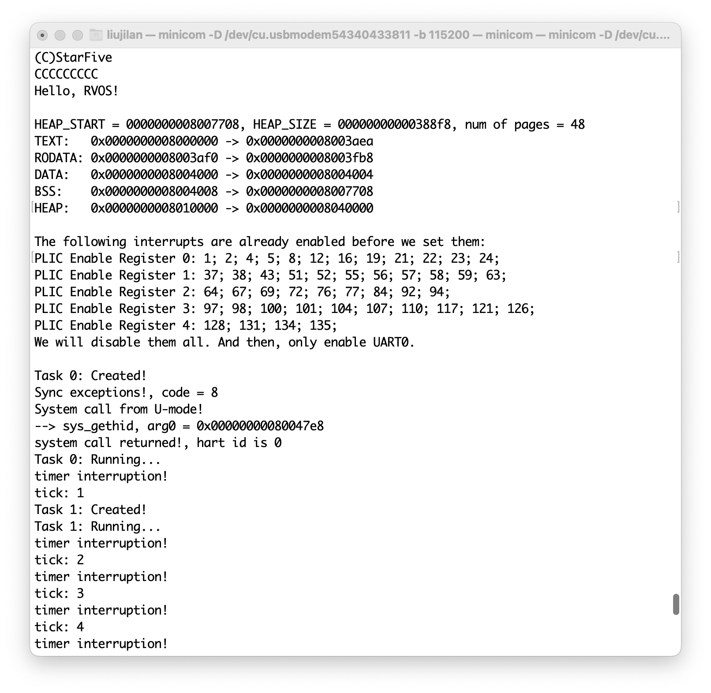

# RVOS_On_VisionFive2
RVOS在VisionFive2开发板上的移植。

[RVOS项目Github地址](https://github.com/plctlab/riscv-operating-system-mooc)


## 成果

- M态RVOS在64位下的移植
- 64位M态RVOS在VisionFive2开发板上的移植
- 64位RVOS在VisionFive2开发板上S态的移植


## 小记

在StarFive的论坛里看到疑似StarFive官方的人说“底层的FW我们都已经调试好了，开发者基本不需要动这些”。

如果ta真是StarFive官方, 我希望官方要知道, 还是有很多人想去做底层。

相比于JH7100的VisionFive, JH7110的VisionFive2很多方面没有开源。例如, 对运行在SRAM上的SPL做处理的`spl_tool`工具和将OpenSBI + Uboot打包的`uboot_its`工具。

By the way, 其实启动用的SRAM大小官方也没提。

尽管如此, 我们还是在官方给出的各种资料中搜刮着有用信息。

希望官方能在合理范围内, 更大方的给出更多的信息。毕竟, 还有有人想写自己的BootLoader, 想写自己的SBI, 想写自己的Kernel...


# M态RVOS


## 成果展示



```shell
(C)StarFive                                                                         
CCCCCCCCC                                                                           
Hello, RVOS!                                                                        
                                                                                    
HEAP_START = 0000000008007708, HEAP_SIZE = 00000000000388f8, num of pages = 48      
TEXT:   0x0000000008000000 -> 0x0000000008003aea                                    
RODATA: 0x0000000008003af0 -> 0x0000000008003fb8                                    
DATA:   0x0000000008004000 -> 0x0000000008004004                                    
BSS:    0x0000000008004008 -> 0x0000000008007708                                    
HEAP:   0x0000000008010000 -> 0x0000000008040000                                    
                                                                                    
The following interrupts are already enabled before we set them:                    
PLIC Enable Register 0: 1; 2; 4; 5; 8; 12; 16; 19; 21; 22; 23; 24;                  
PLIC Enable Register 1: 37; 38; 43; 51; 52; 55; 56; 57; 58; 59; 63;                 
PLIC Enable Register 2: 64; 67; 69; 72; 76; 77; 84; 92; 94;                         
PLIC Enable Register 3: 97; 98; 100; 101; 104; 107; 110; 117; 121; 126;             
PLIC Enable Register 4: 128; 131; 134; 135;                                         
We will disable them all. And then, only enable UART0.                              
                                                                                    
Task 0: Created!                                                                    
Sync exceptions!, code = 8                                                          
System call from U-mode!                                                            
--> sys_gethid, arg0 = 0x00000000080047e8                                           
system call returned!, hart id is 0                                                 
Task 0: Running...                                                                  
timer interruption!                                                                 
tick: 1                                                                             
Task 1: Created!                                                                    
Task 1: Running...                                                                  
timer interruption!
tick: 2                                                                             
timer interruption!
tick: 3
timer interruption!
tick: 4
timer interruption!
...
```


## 板子参数

CPU: JH7110 

> 使用IP: SiFive U74-MC (4+1核) + SiFive E24(会被当作外设被U74-MC额外启动)

UART: 8250芯片兼容

其他参数略


## 移植思路

对于一块板子, 尤其是这块板子比较新的时候。资料会散布在各个位置, 需要扫读能找到的所有资料, 大致了解你现在能知道什么, 并对每个信息的位置有个模糊的记忆。这对后期具体移植工作是有帮助的。


### CPU相关移植

RV32至RV64, 这个过程推荐在QEMU上完成。

主要是`lw`、`sw`换为`ld`、`sd`, 一些有关地址的`uint32_t`改为`uint64_t`。与寄存器相关的数据结构与偏移也需要相应调整。还有`printf`从32位移植到64位( `printf`改动全部由GPT4.0完成 )。移植过程见GitHub Commit历史。

PS: 我对PLIC Enable部分的一个宏做了补充修改。我觉得这属于老师的小失误, 因为原RVOS中, UART的PLIC中断ID是小于32的。

PS: 由于QEMU所模拟的芯片为SiFive旗下的FU540, 所以CLINT和PLIC部分几乎没有什么大的改动。


### 有关mtime频率

关于mtime, 在CPU手册的**6.11.1 Timer Register**节中提到:

> mtime is a 64-bit read-write register that contains the number of cycles counted from the rtc_toggle signal described in the U74-MC Core Complex User Guide. On reset, mtime is cleared to zero.

如果查看JH7110手册时钟图能看出24M的时钟被/6后引入了芯片的rtc_toggle中。

另外, 这个值会在设备树中以以下方式被引入:

```
cpus {
		timebase-frequency = <4000000>;
	};
```


### 启动流程

1. 对启动流程的研究是向具体开发板移植的第一步。参考了[昉·惊鸿7110启动手册](https://doc.rvspace.org/VisionFive2/Developing_and_Porting_Guide/JH7110_Boot_UG/index.html)。

    简言之的启动流程是:**BootROM** > **SPL** > **U-Boot** (OpenSBI + Uboot) > **Linux**

    

2. 确定我们的系统将取代启动流程中的哪一个步骤

   1. 由于RISC-V的体系结构设计, 我们要清楚自己要移植的系统是运行在什么权级的。这将是确定取代启动流程中哪个步骤的重要依据。

      在我们这次移植中: **RVOS的内核态就是运行在M态的**。

      

   2. 讨论每个替代部分的可行性

      | 可能替代的部分 | 可行性                                                       | 代价                                                         |
      | :------------- | :----------------------------------------------------------- | :----------------------------------------------------------- |
      | BootROM        | ROM, 几乎不可行<br />(其实有可能, 因为芯片的恢复工具中有这一部分) | 有损坏板子的风险                                             |
      | SPL            | M态, 甚至可以用UART的XMODEM快速加载                          | 被加载的目标是小容量的SRAM而不是DDR内存                      |
      | OpenSBI        | M态, 被加载入DDR, 可行                                       | 根据启动要求至少写入一个介质里<br />(Flash、EMMC、SD卡)<br />还需处理介质的分区方案<br />但可能有一些被SPL加载的标准要遵循 |
      | U-Boot         | S态, 被加载入DDR, 通过重新编译/设置SBI或许可行               | 官方给出的SBI的下一权级是S态, 如果替代将要对SBI做一些修改    |
      | Linux          | S态, 被加载入DDR, 且要遵循一定的内核标准才能被载入           | 要对SBI做修改, 且要可能要遵循一些标准                        |

      

   3. 综上所述, 我个人最终选择了**替换掉SPL**。好处是可以用UART快速载入并调试, 待成熟可以进一步考虑烧录进SD卡。缺点是只能使用SRAM空间, 而且由于手册暂时还有待完善, SRAM的大小是根据[这里](https://doc.rvspace.org/VisionFive2/Developing_and_Porting_Guide/JH7110_Boot_UG/JH7110_SDK/boot_address_allocation.html)提到的SPL在Flash中的分配空间推算出来的。

   

3. 查询手册找到自己替换目标的正确形式

   这里参考这份[昉·星光 2单板计算机软件技术参考手册](https://doc.rvspace.org/VisionFive2/SW_TRM/index.html)手册, 里面提到了如何编译U-Boot( SPL包含在其中 )和OpenSBI。我们重点关注[创建SPL文件](https://doc.rvspace.org/VisionFive2/SW_TRM/VisionFive2_SW_TRM/create_spl.html)部分, 可以看到本开发板使用的SPL需要一个额外的步骤。与上一代的VisionFive不同, SPL使用的不再是bin文件, 而是被官方工具加工后的out文件。

   所以我们在编译出bin文件后需要按照[创建SPL文件](https://doc.rvspace.org/VisionFive2/SW_TRM/VisionFive2_SW_TRM/create_spl.html)部分的指示, 额外准备好`spl_tool`工具。

   **PS:** 如果你打算替换的目标是其他部分, 也需要额外注意, SPL引导的OpenSBI + Uboot部分也是需要用官方的`uboot_its`工具打包成img文件的形式。

   


### 外设(UART)移植

1. 波特率

   外设其实我们主要移植的是UART 。由于使用UART启动时, 本身就有UART输出, 这意味着我们无需再次配置UART的波特率。其实这也是无奈之举, 因为关于芯片频率的信息暂时没有那么明确, 我个人找到的参考是[JH7110-common dtsi](https://github.com/starfive-tech/linux/blob/JH7110_VisionFive2_devel/arch/riscv/boot/dts/starfive/jh7110-common.dtsi)中的信息:

   ```
   cpus {
   		timebase-frequency = <4000000>;
   	};
   ```

   

2. 寄存器信息

   关于UART详细的寄存器信息, 其实文档没有给出, 在JH7110的正在编写中的详细手册中提到了部分外设的内存映射。

   > *PS: 由于是正在更新中的手册, 担心链接失效 , 我就不上链接了。*
   >
   > *PS: 说"部分"是因为至少SRAM的地址我是没在其中看到的, 尽管设备树中也没有。另外, 只有大的内存映射空间, 没有详细寄存器。*

   这里参考的是[昉·惊鸿7110 UART开发手册](https://doc.rvspace.org/VisionFive2/Developing_and_Porting_Guide/JH7110_SDK_DG_UART/index.html), 在其中提到了`8250 UART驱动程序：它是昉·惊鸿7110 SoC平台的初始化和数据通信平台`。所以我们使用8250的寄存器手册。

   另外在[设备树配置](https://doc.rvspace.org/VisionFive2/Developing_and_Porting_Guide/JH7110_SDK_DG_UART/JH7110_SDK/general_uart_controller.html)一节的内容中提到了需要的额外信息(有关中断号的问题我们在后面提及):

   ```c
   uart0: serial@10000000 {
           compatible = "snps,dw-apb-uart";
           reg = <0x0 0x10000000 0x0 0x10000>;
           reg-io-width = <4>;
           reg-shift = <2>;
           clocks = <&clkgen JH7110_UART0_CLK_CORE>, 
                    <&clkgen JH7110_UART0_CLK_APB>;
           clock-names = "baudclk", ”apb_pclk";
           resets = <&rstgen RSTN_U0_DW_UART_APB>,
                    <&rstgen RSTN_U0_DW_UART_CORE>;
           interrupts = <32>;
           status = "disabled";
   };
   ```

   我们主要关注`reg-io-width = <4>;`与`reg-shift = <2>;`。他们代表了每个寄存器的访问位宽和偏移。我也是第一次知道, 再次感谢GPT。

   

3. PLIC中的UART中断号

   有三个提分提到了UART0的中断号:

   1. 在[设备树配置](https://doc.rvspace.org/VisionFive2/Developing_and_Porting_Guide/JH7110_SDK_DG_UART/JH7110_SDK/general_uart_controller.html)一节中提到了, 中断号为32。

      

   2. 在JH7110的正在编写中的详细手册的一节中的**Interrupt Connections**提到了`u0_dw_uart`到`u0_u7mc_sft7110(clock)`的连接是`global_interrupts[27]`。

      

   3. 在Linux中用`cat /proc/interrupts`查看( 注意, 我只列出来一部分 ):

      ```shell
      user@starfive:~$ cat /proc/interrupts
                 CPU0       CPU1       CPU2       CPU3       
       17:       1463          0          0          0  SiFive PLIC  32 Edge      ttyS0
      ```

      其中指出, 对于PLIC, ttyS0(也就是UART0)的id为32。

      

   4. 通过最终上板实验, 我确定UART0使用的PLIC中断ID为32。

      > 造成32与27差异的**我的个人推测**是, 在[U74-MC手册](https://www.sifive.com/cores/u74-mc)的10.2节中提到, 有一些PLIC的中断ID被使用了。而`External Global Interrupts`的ID号是5-131, 正好是32和27的差值。注意这只是我的推测。


# M态移植中的注意事项


## 数据自然大小对齐

在《RISC-V-Reader-Chinese-v2p1》提到:

> 虽然 ARM-32 和 MIPS-32 要求存储在内存中的数据，要按照数据的自然大小进行边界 对齐，但是 RISC-V 没有这个要求。

但是其实在实际的实践中, 部分设计还是要求按照数据的自然大小对齐。其实RISC-V官方对此应该是有所预料:

> Subsets of the base integer ISA might be useful for pedagogical purposes, but the base has been defined such that there should be little incentive to subset a real hardware implementation beyond omitting support for misaligned memory accesses and treating all SYSTEM instructions as a single trap.

JH7110中, **要求以数据的自然大小对齐**。所以在移植时, 修改了sched.c的`task_create`函数, 以适应对齐要求:

```c
int task_create(void (*start_routin)(void))
{
	if (_top < MAX_TASKS) {
		ctx_tasks[_top].sp = (reg_t) &task_stack[_top][STACK_SIZE - 1] & ~((reg_t)0x7);
		ctx_tasks[_top].pc = (reg_t) start_routin;
		_top++;
		return 0;
	} else {
		return -1;
	}
}
```


## 启动地址

SRAM的地址没有在内存映射与设备树中提及, 只在[昉·惊鸿7110启动手册](https://doc.rvspace.org/VisionFive2/Developing_and_Porting_Guide/JH7110_Boot_UG/index.html)有所提及。注意, 地址为`0x0800_0000`不是`0x8000_0000`。另外请想移植到能在DDR上运行的同学注意, DDR地址在`0x4000_0000`不是`0x8000_0000`。


## PLIC中断使能问题

在原RVOS中, 我们认为PLIC所有中断使能都是关闭的, 但是板子上其实有很多中断在上电后就是开着的。所以我们需要首先将他们都禁用再打开我们需要的中断。


## Mac用户使用minicom的XMODEM功能

VisionFive2的UART启动时, 使用xmodem协议接收。MacOS使用brew下载minicom时, 没有一并下载用于传输的库, 需要额外用brew安装lrzsz。另外, Mac中即使使用brew安装了lrzsz也没有minicom默认使用的sx了, 只有lsx, 需要额外配置一下。


## SD卡镜像

尽管选择的资料完全能够支撑将我们现在的成果转移到用SD镜像启动, 但是个人的时间并不充裕。感兴趣的同学可以尝试。


# S态RVOS


## 成果展示

在这里只展示U-Boot menu之后的部分:

```shell
U-Boot menu
1:      Debian GNU/Linux bookworm/sid 5.15.0-starfive
2:      Debian GNU/Linux bookworm/sid 5.15.0-starfive (rescue target)
3:      RVOS-Hello
4:      RVOS
Enter choice: 4
4:      RVOS
Retrieving file: /rvos_image.bin
16452 bytes read in 7 ms (2.2 MiB/s)
Retrieving file: /dtbs/starfive/jh7110-visionfive-v2.dtb
48366 bytes read in 9 ms (5.1 MiB/s)
## Booting kernel from Legacy Image at 44000000 ...
   Image Name:   
   Image Type:   RISC-V Linux Kernel Image (uncompressed)
   Data Size:    16388 Bytes = 16 KiB
   Load Address: 40200000
   Entry Point:  40200000
   Verifying Checksum ... OK
## Flattened Device Tree blob at 48000000
   Booting using the fdt blob at 0x48000000
   Loading Kernel Image
   Using Device Tree in place at 0000000048000000, end 000000004800eced

Starting kernel ...

clk u2_dw_i2c_clk_core already disabled
clk u2_dw_i2c_clk_apb already disabled
clk u5_dw_i2c_clk_core already disabled
clk u5_dw_i2c_clk_apb already disabled

Hello, RVOS!

Hart ID: 1
DTB is at 0000000048000000
sstatus:8000000200006000
HEAP_START = 0000000040207710, HEAP_SIZE = 00000001ffdf88f0, num of pages = 2096624
TEXT:   0x0000000040200000 -> 0x0000000040202fc8
RODATA: 0x0000000040202fc8 -> 0x00000000402034e0
DATA:   0x0000000040204000 -> 0x0000000040204004
BSS:    0x0000000040204008 -> 0x0000000040207710
HEAP:   0x0000000040210000 -> 0x0000000240000000

The following interrupts are already enabled before we set them:
PLIC Enable Register 0: None!
PLIC Enable Register 1: None!
PLIC Enable Register 2: None!
PLIC Enable Register 3: None!
PLIC Enable Register 4: None!
We will disable them all. And then, only enable UART0.

timer interruption!
tick: 1
timer interruption!
tick: 2
timer interruption!
tick: 3
timer interruption!
tick: 4
timer interruption!
tick: 5
Task 1: Created!
Task 1: Running... 
timer interruption!
tick: 6
Task 0: Created!
Sync exceptions!, code = 8
System call from U-mode!
--> sys_gethid, arg0 = 0x00000000402047e8
system call returned!, hart id is 1
Task 0: Running... 
timer interruption!
tick: 7
timer interruption!
tick: 8
Task 0: Running... 
timer interruption!
tick: 9
Task 1: Running... 
timer interruption!
tick: 10
Task 0: Running... 
timer interruption!
tick: 11
Task 1: Running... 
timer interruption!
tick: 12
timer interruption!
tick: 13
Task 1: Running... 
timer interruption!
tick: 14
Task 0: Running... 
timer interruption!
tick: 15
timer interruption!
tick: 16
Task 0: Running... 
timer interruption!
tick: 17
```

PS: 有一段密集的时钟中断, 是由于SBI对时钟中断的处理用的是绝对时间点导致的, 我还没有想好怎么处理这个问题。


## 有关U-Boot引导下的S态启动

官方的指导中有一点没说清楚, 应该设置的extlinux在SD卡第三分区中。


## 有关SBI TIMER的参数问题(在此只讨论openSBI)

首先, 至少在我所看的这版openSBI源码中, Legacy Extensions中的Set Timer和Timer Extension的Set Timer本质用的是同一代码。

在我使用的 Version 1.0.0, March 22, 2022: Ratified 版本的 sbi-doc 中, Legacy Extensions中的Set Timer和Timer Extension的Set Timer只在后者的说明中强调了“**stime_value** is in absolute time.”。我个人在此之前一直以为“Programs the clock for next event after **stime_value** time.”这段意味着stime_value是一个时间段, 但这个理解是错误的, **stime_value**应该是时间点。


## 有关SBI TIMER的具体实现问题(在此只讨论openSBI)

本问题本质上是上一问题的延续。其主要讨论**stime_value**是直接作用在`xtimecmp`上的还是说会在第一次调用时为0起点来处理。PS: 这里使用`xtimecmp`而非`mtimecmp`是因为openSBI代码中已经明确有处理`stimecmp`的情况。

另外openSBI的具体实现如下(注意两者本质上是一个函数, 我们这里就以Legacy Extensions中的Set Timer为例):

```c
	case SBI_EXT_0_1_SET_TIMER:
#if __riscv_xlen == 32
		sbi_timer_event_start((((u64)regs->a1 << 32) | (u64)regs->a0));
#else
		sbi_timer_event_start((u64)regs->a0);
#endif
		break;
```

`sbi_timer_event_start`的实现是:

```c
void sbi_timer_event_start(u64 next_event)
{
	sbi_pmu_ctr_incr_fw(SBI_PMU_FW_SET_TIMER);

	/**
	 * Update the stimecmp directly if available. This allows
	 * the older software to leverage sstc extension on newer hardware.
	 */
	if (sbi_hart_has_extension(sbi_scratch_thishart_ptr(), SBI_HART_EXT_SSTC)) {
#if __riscv_xlen == 32
		csr_write(CSR_STIMECMP, next_event & 0xFFFFFFFF);
		csr_write(CSR_STIMECMPH, next_event >> 32);
#else
		csr_write(CSR_STIMECMP, next_event);
#endif
	} else if (timer_dev && timer_dev->timer_event_start) {
		timer_dev->timer_event_start(next_event);
		csr_clear(CSR_MIP, MIP_STIP);
	}
	csr_set(CSR_MIE, MIP_MTIP);
}
```

从这里可以看出, 如果有`stimecmp`实现的话, 是直接写入`stimecmp`。

`timer_event_start`是`sbi_timer_device`类的方法。*(PS: C语言是确实存在类的概念的, 例如Linux的VFS实现)*

而对于我们的板子我推测使用的是以下实例:

```c
static struct sbi_timer_device mtimer = {
	.name = "aclint-mtimer",
	.timer_value = mtimer_value,
	.timer_event_start = mtimer_event_start,
	.timer_event_stop = mtimer_event_stop
};
```

对应的具体方法是:

```c
static void mtimer_event_start(u64 next_event)
{
	u32 target_hart = current_hartid();
	struct sbi_scratch *scratch;
	struct aclint_mtimer_data *mt;
	u64 *time_cmp;

	scratch = sbi_hartid_to_scratch(target_hart);
	if (!scratch)
		return;

	mt = mtimer_get_hart_data_ptr(scratch);
	if (!mt)
		return;

	/* Program MTIMER Time Compare */
	time_cmp = (void *)mt->mtimecmp_addr;
	mt->time_wr(true, next_event,
		    &time_cmp[target_hart - mt->first_hartid]);
}
```

其中, `struct aclint_mtimer_data `的原型是:

```c
struct aclint_mtimer_data {
	/* Public details */
	unsigned long mtime_freq;
	unsigned long mtime_addr;
	unsigned long mtime_size;
	unsigned long mtimecmp_addr;
	unsigned long mtimecmp_size;
	u32 first_hartid;
	u32 hart_count;
	bool has_64bit_mmio;
	bool has_shared_mtime;
	/* Private details (initialized and used by ACLINT MTIMER library) */
	struct aclint_mtimer_data *time_delta_reference;
	unsigned long time_delta_computed;
	u64 (*time_rd)(volatile u64 *addr);
	void (*time_wr)(bool timecmp, u64 value, volatile u64 *addr);
};
```

在`aclint_mtimer_cold_init`中我们能看到`mt->time_wr`的具体实现:

```c
int aclint_mtimer_cold_init(struct aclint_mtimer_data *mt,
			    struct aclint_mtimer_data *reference)
{
	u32 i;
	int rc;
	struct sbi_scratch *scratch;

	/* Sanity checks */
	if (!mt ||
	    (mt->hart_count && !mt->mtimecmp_size) ||
	    (mt->mtime_size && (mt->mtime_addr & (ACLINT_MTIMER_ALIGN - 1))) ||
	    (mt->mtime_size && (mt->mtime_size & (ACLINT_MTIMER_ALIGN - 1))) ||
	    (mt->mtimecmp_addr & (ACLINT_MTIMER_ALIGN - 1)) ||
	    (mt->mtimecmp_size & (ACLINT_MTIMER_ALIGN - 1)) ||
	    (mt->hart_count > ACLINT_MTIMER_MAX_HARTS))
		return SBI_EINVAL;
	if (reference && mt->mtime_freq != reference->mtime_freq)
		return SBI_EINVAL;

	/* Allocate scratch space pointer */
	if (!mtimer_ptr_offset) {
		mtimer_ptr_offset = sbi_scratch_alloc_type_offset(void *);
		if (!mtimer_ptr_offset)
			return SBI_ENOMEM;
	}

	/* Initialize private data */
	aclint_mtimer_set_reference(mt, reference);
	mt->time_rd = mtimer_time_rd32;
	mt->time_wr = mtimer_time_wr32;

	/* Override read/write accessors for 64bit MMIO */
#if __riscv_xlen != 32
	if (mt->has_64bit_mmio) {
		mt->time_rd = mtimer_time_rd64;
		mt->time_wr = mtimer_time_wr64;
	}
#endif
  ...
```

更进一步:

```c
static void mtimer_time_wr64(bool timecmp, u64 value, volatile u64 *addr)
{
	writeq_relaxed(value, addr);
}
```

再根据之前`mt->time_wr(true, next_event, &time_cmp[target_hart - mt->first_hartid]);`不难得出, 本质上是对`mtimecmp`的直接写入。

**综上所述**, **stime_value**是直接作用在`xtimecmp`上的。


## 有关第一次用SBI TIMER设置S态时钟中断的问题

从上个问题可以看出, **stime_value**是直接作用在`xtimecmp`上的。

那么对于只有`mtimecmp`的CPU来说, 在S态中第一次设置中断就是一个问题。

我们利用SBI的异常处理获得`mtime`。xv6-k210用的是`asm volatile("rdtime %0" : "=r" (x) );`。 而我选择改用`asm volatile("csrr %0, 0x0C01" : "=r" (x) );`, 这是从openSBI的[这里](https://github.com/riscv-software-src/opensbi/blob/master/lib/sbi/sbi_emulate_csr.c)去找`CSR_TIME`对应的宏。


# 有关JTAG


## JTAG的存在

有关VisionFive2的JTAG有其实StarFive官方没有明说, 但是其实是存在的。

参考论坛中的的[这篇文章](https://forum.rvspace.org/t/jtag-ports/890), 注意这篇文章中有关JTAG的GPIO引脚还是有些模糊的。

我们可以看这篇文章其中提到的[U-Boot源码](https://github.com/starfive-tech/u-boot/blob/JH7110_VisionFive2_devel/board/starfive/visionfive2/starfive_visionfive2.c), 其中提到:

```c
static void jh7110_jtag_init(void)
{
	/*jtag*/
	SYS_IOMUX_DOEN(36, HIGH);
	SYS_IOMUX_DIN(36, 4);
	SYS_IOMUX_DOEN(61, HIGH);
	SYS_IOMUX_DIN(61, 19);
	SYS_IOMUX_DOEN(63, HIGH);
	SYS_IOMUX_DIN(63, 20);
	SYS_IOMUX_DOEN(60, HIGH);
	SYS_IOMUX_DIN(60, 29);
	SYS_IOMUX_DOEN(44, 8);
	SYS_IOMUX_DOUT(44, 22);
}
```

而`jh7110_jtag_init`位于`board_init`:

```c
int board_init(void)
{
	enable_caches();

	jh7110_jtag_init();
	jh7110_timer_init();

	jh7110_usb_init(true);

	jh7110_i2c_init(5);
	jh7110_gpio_init();

	return 0;
}
```

我不知道这个函数是否被囊括在SPL中, 于是查了一下, 在[SPL的代码](https://github.com/starfive-tech/u-boot/blob/b6e2b0e85c774a18ae668223a6e5f7d335895243/board/starfive/visionfive2/spl.c)中也有JTAG的初始化部分:

```c
	/*jtag*/
	SYS_IOMUX_DOEN(36, HIGH);
	SYS_IOMUX_DIN(36, 4);
	SYS_IOMUX_DOEN(61, HIGH);
	SYS_IOMUX_DIN(61, 19);
	SYS_IOMUX_DOEN(63, HIGH);
	SYS_IOMUX_DIN(63, 20);
	SYS_IOMUX_DOEN(60, HIGH);
	SYS_IOMUX_DIN(60, 29);
	SYS_IOMUX_DOEN(44, 8);
	SYS_IOMUX_DOUT(44, 22);
```

**既然如此便意味着在SPL段便可以使用JTAG**。这对使用JTAG大有益处,  因为在VisionFive2的启动流程下, 其实第二段U-Boot使用的地址和内核理论上是一致的, 如果在第二段U-Boot才能使用JTAG, 对于断点之类的设置是一大麻烦。


## SEGGER JLINK


 ### 对U74-MC的支持

SEGGER官方已经支持了U74-MC, 注意把JLINK软件升级到最新(或者支持的版本之后)即可。


### 两个未知设备

StarFive在设计JH7110的时候可能根本没想过有人会做特别底层的DEBUG, 以至于JH7110中的U74-MC和E24的DeviceID都是一模一样的:

```shell
TotalIRLen = 10, IRPrint = 0x0021
JTAG chain detection found 2 devices:
#0 Id: 0x07110CFD, IRLen: 05, Unknown device
#1 Id: 0x07110CFD, IRLen: 05, Unknown device
```

很幸运的是, SEGGER官方在[这里](https://wiki.segger.com/J-Link_RISC-V)说明了这种情况。注意, #0应该是E24, 而#1才是U74-MC。

注意使用WiKi中的[Template_ConnectTAP1.JLinkScript](https://wiki.segger.com/images/b/b6/Template_ConnectTAP1.JLinkScript)来选择TAP1以访问U74-MC。


## SEGGER OZONE HART选择问题


### 选择的原理

参照[RISC-V官方有关DEBUG的文档](https://github.com/riscv/riscv-debug-spec), 并结合U74-MC的文档查看。

对`DMI`下`dmcontrol`中的`hartsel`进行读写操作。注意, 官方手册中`hartsel`由`hartsello`和`hartselhi`构成。但U74-MC没有使用`hartselhi`, `hartsel`就位于`hartsello`处。


### 实际遇到的选hart问题

但是即使在JLINK SCRIPT下操作了, 检查hartid依旧处于0号hart。

由于openOCD能正常使用, 我还特地去看了openOCD有关RISC-V选HART的部分的源代码, 发现**底层实现是一样的**。所以我怀疑是OZONE的软件问题, 毕竟它读的`zero`寄存器都不是0。

论坛中有人给出了openOCD用的`config.tcl`的代码, 在[这里](https://forum.rvspace.org/t/openocd-config-for-visionfive-2/1452)。

通过`openocd -f config.tcl `运行, 注意, 代码中没有包含adapter的部分, 这部分根据自己的adapter来写, 例如我用的SEGGER JLINK V11, 完整代码为:

```
# config.tcl

adapter driver jlink

reset_config trst_only

transport select jtag

adapter speed 4000

jtag newtap e24 cpu -irlen 5 -expected-id 0x07110cfd
jtag newtap u74 cpu -irlen 5 -expected-id 0x07110cfd

#target create e24.cpu0 riscv -chain-position e24.cpu -coreid 0
target create u74.cpu0 riscv -chain-position u74.cpu -coreid 0 -rtos hwthread
target create u74.cpu1 riscv -chain-position u74.cpu -coreid 1
target create u74.cpu2 riscv -chain-position u74.cpu -coreid 2
target create u74.cpu3 riscv -chain-position u74.cpu -coreid 3
target create u74.cpu4 riscv -chain-position u74.cpu -coreid 4
target smp u74.cpu0 u74.cpu1 u74.cpu2 u74.cpu3 u74.cpu4

init
```

另外我也给出我的JLINK SCRIPT脚本, 改动于[这个脚本](https://forum.segger.com/index.php/Thread/9008-Risc-V-core-hart-selection/):

```c
int InitTarget(void)
{
    //
    // TDI -> TAP_#1 -> TAP_#0 -> TDO
    //
    // TAP_#0 info:
    //   Maybe E24?
    //   IRLen: 5
    //
    // TAP_#1 info:
    //   U74-MC here
    //   IRLen: 5
    //
    //
    // Code to connect to TAP_#1
    //
    int tap;
    tap = 1;
    if (tap) {
        JLINK_JTAG_DRPre  = 1;
        JLINK_JTAG_DRPost = 0;
        JLINK_JTAG_IRPre  = 5;
        JLINK_JTAG_IRPost = 0;
        JLINK_JTAG_IRLen  = 5;
    } else {
        JLINK_JTAG_DRPre  = 0;
        JLINK_JTAG_DRPost = 1;
        JLINK_JTAG_IRPre  = 0;
        JLINK_JTAG_IRPost = 5;
        JLINK_JTAG_IRLen  = 5;
    }
    JLINK_SetDevice("U74-MC");
    return 0;
}

 // Select needed hart
 // Seems Jlink could not handle multi-core debugging at the same time through script file?
 // Or there exists some APIs not written in official wiki that could handle this?
 int SetupTarget(void)
 {
 int ret;
 
 U32 dmcontrol_addr;
 U32 hawindow_addr;
 
 U32 hasel_mask;
 U32 hartsello_mask;
 U32 hartselhi_mask;
 U32 hartsel_mask;
 
 U32 dmcontrol_value;
 U32 hawindow_value;
 U32 hart_id;
 U32 hart_id_target;
 
 // Set wanted hart id here(0 is S7 core, 1~4 is U74 core)
 hart_id = 1;
 
 ret = 0;
 hasel_mask = 0x04000000;
 dmcontrol_addr = 0x10;
 hawindow_addr = 0x15;
 hartsel_mask = 0x03FF0000;
 
 // Core selection through writing DMI registers
 
 // First, do automatic configure
 // Needed or connection would fail
 ret = JLINK_RISCV_DMI_AutodetectDMISettings();
 if(ret < 0)
 {
 return ret;
 }
 ret = JLINK_RISCV_DMI_ReadReg(dmcontrol_addr, &dmcontrol_value);
 if(ret < 0)
 {
 return ret;
 }
 hart_id_target = (dmcontrol_value & hartsel_mask) >> 16;
 JLINK_SYS_Report("********************************");
 JLINK_SYS_Report("Pre-selection info");
 JLINK_SYS_Report1("dmcontrol value is: ", dmcontrol_value);
 JLINK_SYS_Report1("Current hart id is: ", hart_id_target);
 JLINK_SYS_Report("********************************");
 
 // Third, modify dmcontrol value to select wanted hart.
 //dmcontrol_value = (dmcontrol_value & ~0x03FF0000) | (hart_id << 16) | hasel_mask;
 dmcontrol_value = (dmcontrol_value & ~0x03FF0000) | (hart_id << 16);
 ret = JLINK_RISCV_DMI_WriteReg(dmcontrol_addr, dmcontrol_value);
 if(ret < 0)
 {
 return ret;
 }
 
 // Fourth, check if configure is successful
 ret = JLINK_RISCV_DMI_ReadReg(dmcontrol_addr, &dmcontrol_value);
 hart_id_target = (dmcontrol_value & hartsel_mask) >> 16;
 JLINK_SYS_Report("********************************");
 JLINK_SYS_Report("Post-selection info");
 JLINK_SYS_Report1("dmcontrol value is: ", dmcontrol_value);
 JLINK_SYS_Report1("Current hart id is: ", hart_id_target);
 JLINK_SYS_Report("********************************");
 
 return ret;
 }
```


### 我最终用来DEBUG的方法

我利用SBI Legacy的putchar打印了一些信息, 发现我当时连C函数都没有进。于是我怀疑是`sp`寄存器有问题季候风然后我用一段汇编来打印出来寄存器, 然后自己写了个小的程序用于解读。

汇编代码片段如下:

```assembly
		csrr t0, stval # 或者 mv t0, sp 等	 # 此处为打印的目标
		li t1, 0x0F
		li t2, 16
	
2:	beqz t2, 3f
		and t3, t0, t1
		addi a0, t3, 0x41
		li   a7, 0x01
		ecall
		srli t0, t0, 4
		addi t2, t2, -1
		j 2b
3:	li a0, 0x0A	# 打一个回车, 方便查看
		li   a7, 0x01
		ecall
```

解读用的小程序的C代码:

```c
#include <stdio.h>

int main(int argc, const char * argv[]) {
    char a[17] = {};
    while (1) {
        printf("Enter:");
        scanf("%s", a);
        for(int i = 15; i >= 0; i--){
            printf("%1X", a[i]-'A');
        }
        printf("\n");
        printf("\n");
    }  
}
```

例如, 用此方法读出的`sstatus`是`AAAGAAAACAAAAAAI`, 解读如下:

```shell
Enter:AAAGAAAACAAAAAAI
8000000200006000
```

*之后再来研究怎么用这些硬件debug工具好了。我已经不知道插拔了多少次SD卡了, 希望之后我能高效优雅的debug。*


# 致谢

再次对RVOS课程的汪辰老师表示感谢。

RVOS作为一个运行在M态和U态的系统, 如果它放在一本介绍操作系统内核的书里, 它就是一个两个进程的Demo系统而已。但正是因为它足够简单, 给了我们按自己意愿去塑造它的空间。

它涵盖了RISC-V体系结构的基础, 作为RISC-V体系结构的入门它是很好的参考。

RVOS的其他移植可见[这里](https://gitee.com/unicornx/riscv-operating-system-mooc/issues/I64EEQ)。
